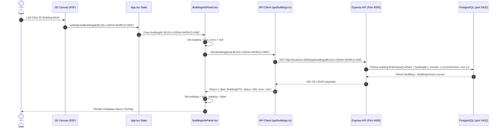

# GEOCAD Frontend Building READ API Integration Documentation

## 1. Overview
The frontend React 3D digital twin interface is now connected directly to the backend PostgreSQL REST API. Hardcoded metadata fallback is no longer used for building specifications.

When a user clicks on any of the 7 towers in the interactive Three.js/R3F 3D canvas, the extracted permanent `buildingId` triggers an asynchronous HTTP request to PostgreSQL via the Express REST API. The returned database record populates the `BuildingInfoPanel` overlay in real time.

---

## 2. API Base URL Configuration
- **Backend API Port**: `4000`
- **Vite Environment Variable**: `VITE_API_BASE_URL`
- **Environment Template**: `frontend/.env.example`
  ```env
  VITE_API_BASE_URL=http://localhost:4000
  ```
- **Local Dev Config**: `frontend/.env`
  ```env
  VITE_API_BASE_URL=http://localhost:4000
  ```

---

## 3. Frontend API Client (`frontend/src/api/buildings.ts`)
A dedicated, strongly-typed API client service executes HTTP requests:

```typescript
export interface BuildingVersionDTO {
  versionNumber: number;
  status: string;
  totalFloors: number | null;
  totalBasements: number | null;
  description?: string | null;
  effectiveFrom?: string;
}

export interface BuildingDTO {
  buildingId: string;
  buildingName: string;
  assetType: string;
  status: string;
  currentVersion: BuildingVersionDTO | null;
  createdAt?: string;
  updatedAt?: string;
}

export async function fetchBuildingById(buildingId: string): Promise<ApiResponse<BuildingDTO>>
```

---

## 4. End-to-End Request/Response Flow



---

## 5. UI States & Database Field Rendering

### A. Database-Backed Fields Displayed
- **Status**: `STATUS: {building.status}` (e.g. `EXISTING`).
- **Building Name**: `{building.buildingName}`.
- **Permanent ID**: `{building.buildingId}` (e.g. `BLDG-LODHA-WORLD-ONE`).
- **Version Number**: `VERSION {building.currentVersion.versionNumber}`.
- **Description**: `{building.currentVersion.description}`.
- **Floors**: Displays `building.currentVersion.totalFloors` if non-null, else renders `"Not configured"`.
- **Basements**: Displays `building.currentVersion.totalBasements` if non-null, else renders `"Not configured"`.

### B. UI Loading State
- Displays a glowing spinner and `"Loading building information..."` indicator while the network request resolves.

### C. Error & 404 Handling
- **404 Not Found**: If an invalid building ID is requested, displays `"Building information not found."`
- **500 / Network Error**: Displays `"Unable to load building information."` without exposing sensitive backend stack traces or database connection strings.

---

## 6. Verification Results

1. **Backend Automated Tests**: Executed `npx tsx test-api.ts` in `backend/` — **ALL 3 TESTS PASSED**.
2. **Frontend Production Build**: Executed `npm run build` in `frontend/` — **PASSED CLEANLY** (`built in 4.61s`).
3. **Interactive Browser E2E Flow**: Tested on `http://localhost:3000` via Browser Subagent:
   - Clicked `BLDG-LODHA-TRUMP` ── Loaded database record `Lodha Trump Tower`, `VERSION 1`, `Floors: Not configured`, `Basements: Not configured`.
   - Clicked `BLDG-LODHA-KIARA` ── Instantly updated overlay to `Lodha Kiara` without page reload.
   - Clicked **Deselect Building** ── Cleared selection and closed overlay.

---

## 7. Files Created / Modified
- [`frontend/src/api/buildings.ts`](file:///C:/Users/daksh/GEOCAD/frontend/src/api/buildings.ts) [NEW]
- [`frontend/src/vite-env.d.ts`](file:///C:/Users/daksh/GEOCAD/frontend/src/vite-env.d.ts) [NEW]
- [`frontend/.env.example`](file:///C:/Users/daksh/GEOCAD/frontend/.env.example) [NEW]
- [`frontend/.env`](file:///C:/Users/daksh/GEOCAD/frontend/.env) [NEW]
- [`frontend/src/components/ui/BuildingInfoPanel.tsx`](file:///C:/Users/daksh/GEOCAD/frontend/src/components/ui/BuildingInfoPanel.tsx) [MODIFIED]
- [`frontend/src/App.tsx`](file:///C:/Users/daksh/GEOCAD/frontend/src/App.tsx) [MODIFIED]
- [`documentation/frontend-building-api-integration.md`](file:///C:/Users/daksh/GEOCAD/documentation/frontend-building-api-integration.md) [NEW]
